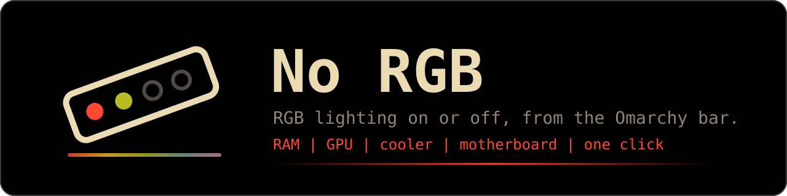
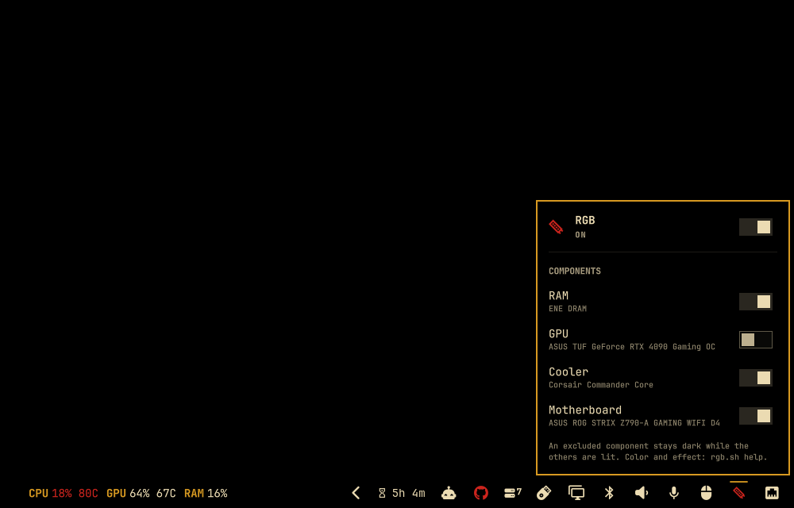

<p align="center">
  
</p>

<p align="center">
  <a href="https://github.com/azeroht/omarchy-no-rgb/actions/workflows/ci.yml"></a>
  <a href="https://github.com/azeroht/omarchy-no-rgb/releases"></a>
  <a href="LICENSE"></a>
</p>

**No RGB** is an [Omarchy](https://omarchy.org) bar plugin that turns the RGB lighting of your
machine on or off in one click: motherboard, RAM, GPU, AIO and fan controllers, LED strips, anything
[OpenRGB](https://openrgb.org) can drive. No vendor app, no Windows, no rainbow at 2 AM.

One click on the bar icon switches the lights. A right click lists the components OpenRGB found,
each with its own switch: keep the RAM lit and the GPU dark, or the other way around.

## 📸 Screenshots

<p align="center">
  
</p>

| Lights on (red icon)                                   | Lights off                                               |
|--------------------------------------------------------|----------------------------------------------------------|
|  |  |

## ✨ Features

- **One-click switch** in the bar, red while the lights are on, with a tooltip such as `RGB: on`.
- **Per component**: every device OpenRGB detects gets its own switch. An excluded component stays
  dark while the others are lit. RAM sticks sharing a name are handled as one component.
- **Your look, kept**: turning the lights on reapplies the saved color and effect (static,
  breathing, spectrum or rainbow), set once with `rgb.sh` from a terminal.
- **Persistent**: the state survives shell restarts and reboots, and is reapplied when the shell
  starts.
- **Works with picky devices**: controllers that only support the Direct mode (some AIO and fan
  hubs) get the same color in Direct mode instead of an error.
- **Multi-monitor aware**: every bar shows the same state, and only one of them restores it.
- **Scriptable** through an IPC target, for keybindings or automation.
- **Safe by design**: no shell is ever interpreted, and component names never reach OpenRGB: devices
  are addressed by index.

## 📦 Requirements

| Requirement                         | Why                                                           |
|-------------------------------------|---------------------------------------------------------------|
| Omarchy 4 with the Quickshell shell | The plugin is an Omarchy shell bar widget                     |
| [OpenRGB](https://openrgb.org) 0.9+ | Talks to the RGB controllers, as a server on `127.0.0.1:6742` |
| `jq`                                | Reads and writes the state file                               |

```bash
sudo pacman -S --needed openrgb jq
sudo systemctl enable --now openrgb
```

The `openrgb` package ships the udev rules and the `openrgb.service` server. Some controllers are
only visible after a reboot, once the `i2c-dev` module it installs is loaded. Check what OpenRGB
sees with:

```bash
openrgb --client 127.0.0.1:6742 --list-devices
```

The server must keep running: some controllers go back to their factory lighting as soon as no
OpenRGB process holds them.

## 🚀 Installation

```bash
omarchy plugin add https://github.com/azeroht/omarchy-no-rgb.git --enable
```

The icon lands in the right section of the bar. To put it somewhere else, for example right after
the microphone:

```bash
omarchy plugin enable azeroht.no-rgb --after omarchy.microphone
```

To pin a reviewed version rather than following `main`, clone a tag into
`~/.config/omarchy/plugins/azeroht.no-rgb`, then rescan the plugins:

```bash
git clone --branch v0.1.0 https://github.com/azeroht/omarchy-no-rgb.git ~/.config/omarchy/plugins/azeroht.no-rgb
omarchy-shell shell rescanPlugins
omarchy plugin enable azeroht.no-rgb
```

## 🗑️ Uninstall

```bash
omarchy plugin remove azeroht.no-rgb
rm -f ~/.local/state/azeroht-no-rgb.json ~/.local/state/azeroht-no-rgb.json.lock
```

`omarchy plugin remove` takes the widget out of the bar and deletes the plugin folder. The lights
keep their last state until OpenRGB or another tool changes them. No RGB writes nothing else: no
configuration file of yours is touched. If you added a keybinding that calls
`omarchy-shell azeroht.no-rgb`, remove it from `~/.config/hypr/bindings.lua` too.

## 🖱️ Usage

| Action                   | Result                                                |
|--------------------------|-------------------------------------------------------|
| Left click on the icon   | Lights on or off                                      |
| Right click on the icon  | Open or close the components panel                    |
| Hover the icon           | Tooltip with the current state                        |
| Panel top switch         | Lights on or off                                      |
| Panel component switch   | Include or exclude that component                     |

While the lights are off, the components stay adjustable but greyed out. An excluded component that
OpenRGB no longer detects (unplugged, renamed) stays listed, so it can be included again.

Color and effect are set from a terminal, with the script shipped in the plugin folder:

```bash
~/.config/omarchy/plugins/azeroht.no-rgb/rgb.sh color ff6600
~/.config/omarchy/plugins/azeroht.no-rgb/rgb.sh mode rainbow        # static, breathing, spectrum, rainbow
~/.config/omarchy/plugins/azeroht.no-rgb/rgb.sh brightness 40
~/.config/omarchy/plugins/azeroht.no-rgb/rgb.sh help
```

Every change is saved in `~/.local/state/azeroht-no-rgb.json`:

```json
{
  "enabled": true,
  "color": "FF6600",
  "brightness": 100,
  "mode": "static",
  "off": ["ASUS TUF GeForce RTX 4090 Gaming OC"]
}
```

`off` lists the excluded components by their OpenRGB name. An invalid or unreadable file falls back
to the defaults: orange, static, full brightness, lights off.

## ⌨️ IPC

The plugin registers the `azeroht.no-rgb` target, handy in Hyprland keybindings or scripts:

```bash
omarchy-shell azeroht.no-rgb toggle   # lights on or off
omarchy-shell azeroht.no-rgb on
omarchy-shell azeroht.no-rgb off
omarchy-shell azeroht.no-rgb open     # components panel, on the focused monitor
omarchy-shell azeroht.no-rgb close
omarchy-shell azeroht.no-rgb status   # "on" or "off"
```

For example, in `~/.config/hypr/bindings.lua`:

```lua
o.bind("SUPER + CTRL + R", "Toggle the RGB lighting", "omarchy-shell azeroht.no-rgb toggle")
```

## ⚙️ How it works

| File                  | Role                                                                   |
|-----------------------|------------------------------------------------------------------------|
| `BarWidget.qml`       | Bar icon, command queue, state file, startup restore, IPC target       |
| `ComponentsPanel.qml` | Components popup built from the native Omarchy UI kit                  |
| `Model.js`            | Pure logic: state validation, component labels, command building       |
| `rgb.sh`              | Saves the state and applies it through the OpenRGB client              |
| `manifest.json`       | Omarchy plugin manifest                                                |

- **Applying**: `rgb.sh` sends the mode and color to every device in one OpenRGB call, sends the
  color in Direct mode to the devices that refused the mode, then paints the excluded components
  black, by device index. Each change takes about two seconds; the icon dims meanwhile, and clicks
  queue up in order.
- **Startup**: when the shell starts, the widget on the first screen runs `rgb.sh restore`, which
  waits until the OpenRGB server has finished detecting the devices (up to 90 s) before reapplying
  the saved state.
- **Several monitors**: each monitor has its own bar, hence its own widget instance. They all watch
  the state file, so they always agree.
- **Brightness**: static and breathing colors are dimmed; spectrum and rainbow effects get the
  OpenRGB brightness option, on the devices that support it.

## 🔒 Security

- Commands run as argument lists (`Quickshell.execDetached` and `Process`), never through a shell
  string.
- Colors, brightness and modes are validated by `rgb.sh`; the state file is sanitized on every
  read, whatever it contains.
- Component names only live in the state file: OpenRGB receives device indexes read from its own
  listing.
- `rgb.sh` runs under a lock, so concurrent calls never corrupt the state file.
- The plugin only talks to the local OpenRGB server, writes a single state file, and makes no
  network access beyond `127.0.0.1`.

## 🧪 Development

```bash
make test   # node --test (model and package) + shell tests of rgb.sh with stubbed openrgb and notify-send
make lint   # bash -n, shellcheck (native or Docker), manifest JSON
```

The shell tests replace `openrgb` and `notify-send` with stubs, so they need neither an OpenRGB
server nor RGB hardware. CI runs both targets on every push and pull request.

Releases follow [Semantic Versioning](https://semver.org): `vX.Y.Z-rc.N` pre-releases first, then
`vX.Y.Z`. See [CHANGELOG.md](CHANGELOG.md).

## 📄 License

[MIT](LICENSE)
